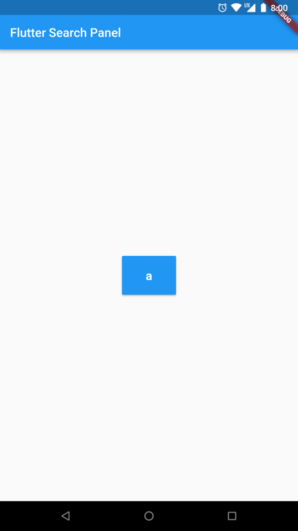
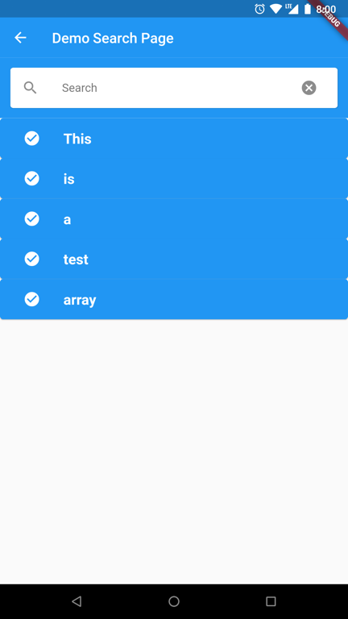

# Flutter Search Panel

[](https://pub.dartlang.org/packages/flutter_search_panel)

A Widget to allow users to search from a list of string and make a selection (Similar to a DropDownButtom).

## Installing

```yaml
dependencies:
  flutter_search_panel: ^1.0.0
```

### Import

```dart
import 'package:flutter_search_panel/flutter_search_panel.dart';
```

## How To Use

```dart
FlutterSearchPanel(
  padding: EdgeInsets.all(10.0),
  selected: 'a',
  title: 'Demo Search Page',
  data: ['This', 'is', 'a', 'test', 'array'],
  icon: new Icon(Icons.check_circle, color: Colors.white),
  color: Colors.blue,
  textStyle: new TextStyle(color: Colors.white, fontWeight: FontWeight.bold, fontSize: 20.0, decorationStyle: TextDecorationStyle.dotted),
  onChanged: (value) {
    print(value);
  },
),
```

## Screenshots

 { width: 200px; }
 { width: 100px; }


## Bugs & Requests

If you encounter any bugs feel free to open an issue. Raise a ticket on github for suggestions. Pull request are also welcome.

### Flutter

For help getting started with Flutter, view our online
[documentation](https://flutter.io/).

For help on editing plugin code, view the [documentation](https://flutter.io/platform-plugins/#edit-code).

## License

MIT License

